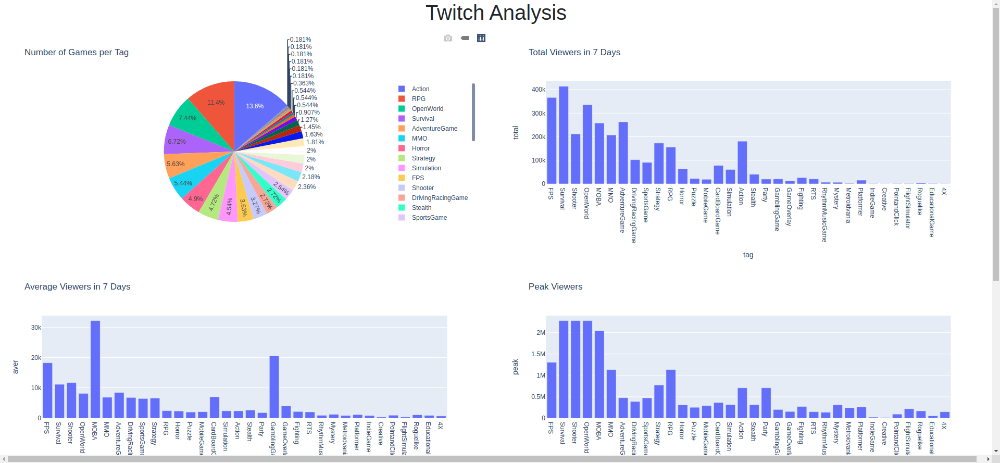

# twitchanal (Twitch Analytics)

A command line tool for Twitch analytics. This is originally a group project of my class at school.

Here is an eaxmple web page generated by this program.



If you want to try this command line tool, you can go to [example](#example) part directry.
## Table of Contents

* [Backgournd](#background)
* [Installation](#installation)
* [Usage](#usage)
  + [save-user](#save-user-command)
  + [collect](#collect-command)
  + [process](#process-command)
* [Example](#example)
  + [[Opitional] Save ID and Secret](#optional-save-id-and-secret)
  + [Collect Data](#collect-data)
  + [Process Data](#process-data)
* [Guide for Developing This Tool](#guide-for-developing-this-tool)
  * [Other Available Online Resources](#other-available-online-resources)
* [Contributors](#contributors)

## Background

eGaming is one of the popular entertainments nowadays. Twitch is a live streaming site popular with gamers that lets you share live game play for others to watch and comment on in real time. You can also watch playbacks of games being played and chat to other gamers. As a result, it created groups of communities which are eager on eGaming, and always discuss and comment on the eGames, and other hot topics. Therefore, the aim of this project is to analyse the eGaming discussion in Twitch. The analysis can be the hot topics discussion, favorite eGamers, eGaming scenes, etc. The project outcomes are expected to help the sports managers to know more about the fans’ favorite eGames, eGaming stars, eGaming scenes, etc., for future eGaming super stars recruitment, eGaming design, and eGames marketing.

## Installation

``` shell
pip3 install .
```

Or for development:

``` shell
pip3 install -e .
```

## Usage

``` shell
Usage: twitchanal [OPTIONS] COMMAND [ARGS]...

Options:
  --version  Show the version and exit.
  --help     Show this message and exit.

Commands:
  collect    Collect data for analysis
  process    Process data and do visualization.
  save-user  Save user id and secret key in `secret.yaml`.
```

### save-user command

In order to call twitch API, we have to pass client id and secret key to it. This tool is used to save your twitch client id and secret key in `secret.yaml` so that you have no need to input mannually next time.

**WARNING:** DO NOT upload your `secret.yaml` file to GitHub or any other public website!!!

``` shell
Usage: twitchanal save-user [OPTIONS]

  Save user id and secret key in `secret.yaml`.

Options:
  --help  Show this message and exit.
```

### collect Command

`collect` command is one of the most important command in this tool. It used to collect top games data and related streams data into csv files. Later, we can use these files to do data analysis.

``` shell
Usage: twitchanal collect [OPTIONS]

  Collect data for analysis

Options:
  -d, --dir TEXT                Directory to store the collected data.
  --timestamp / --no-timestamp  Whether to use timestamp as suffix for data
                                file.

  -n, --num INTEGER             Number of games to collect.
  --help                        Show this message and exit.
```

### process Command

This command is to process data and show analized results in figures.

``` shell
Usage: twitchanal process [OPTIONS]

  Process data and do visualization.

Options:
  --debug               Run in debug mode.
  -d, --dir TEXT        Data directory.
  -t, --timestamp TEXT  Data timestamp. Specify which csv file to use or the
                        program will use the latest one by default.

  --help                Show this message and exit.
```

## Example

### [Optional] Save ID and Secret

First of all, go to [Twitch console](https://dev.twitch.tv/console/apps) to create an applicaiton and get a client ID with a secret key. They are needed to run this tool.

If you do not want to input client ID and secret key every time, you can run

``` shell
twitchanal save-user
```

Then a file named `secret.yaml` will be created in current folder. It stores your client ID and secret key. Next time you run the tool, go to the folder where contains the `secret.yaml` file. And you have no need to input client ID and secret key again.

### Collect Data

Before we start to conduct data analysis, we have to collect data first. Simply run:

``` shell
twitchanal collect
```

It will save data in folder named `dataset` . There is an example of the dataset folder.

``` shell
dataset
├── game_streams_1604853653
│   ├── game_7DaystoDie_1604853653.csv
│   └── ...
└── top_games_1604853653.csv
```

There suffix of the file name is a timestamp. It tells us when we collect the data. **But it is just a approximate time**. This tool uses the time of starting collect `top_games` as the timestamp for all data files. Since we do not need a accurate time to do data analysis. This is acceptable.

- `top_games_xxxx.csv` contains the data of top games.
- `game_streams_xxxx.csv` contains the data of a certain game stream.

### Process Data

``` shell
twichanal process [-d] [-t]
```

Program will create a web page and run on http://127.0.0.1:8050/


## Guide for Developing This Tool

This is originally a group project of my class. Because when working on this project, some of our members are new to programming, there are some materials maybe useful for coding.

Check the [guide](./docs/software-guide.md) here.

### Other Available Online Resources

1. [Twitch API](https://dev.twitch.tv/docs/api)
2. [Python Twitch API Library 1](https://pytwitchapi.readthedocs.io/en/latest/index.html)
3. [Python Twitch API Library 2](https://github.com/tsifrer/python-twitch-client)
4. [Online Dataset](https://clivecast.github.io/)

To test twitch api easily, you are recommended to download [postman](https://www.postman.com/).

And some groupmate may be confused with how to generate token for Twitch API. You can read this post: [How generate token for Twitch API](./docs/generate_token_for_api.md).

## Contributors

Thanks to all team members.

TODO: CHANGE THE CONTIBUTOR IMAGE! (THE REPO HAS BEEN RENAMED)
<a href="https://github.com/yuukidach/eGaming-Analytics/graphs/contributors">
  
</a>
